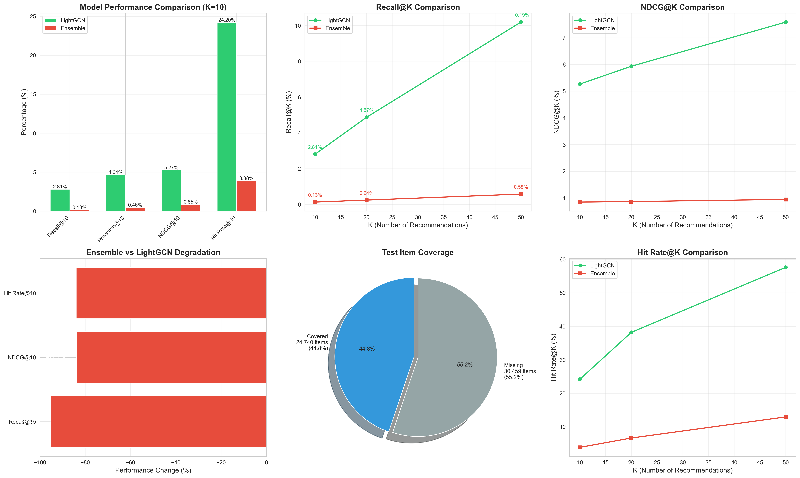
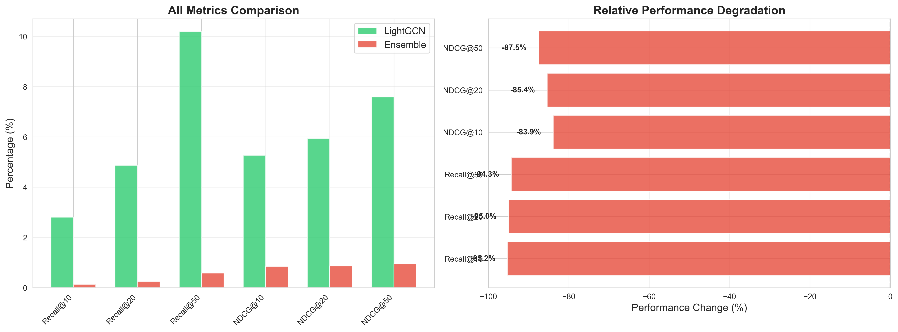

# Ensemble Evaluation Results

**Evaluation Date**: 2025-11-13  
**Status**: FAILED - DO NOT DEPLOY  
**Recommendation**: Continue using LightGCN as production model

---

## Quick Summary

The ensemble recommender (70% LightGCN + 30% Two-Tower) shows **catastrophic performance degradation**:

| Metric | LightGCN | Ensemble | Change |
|--------|----------|----------|--------|
| Recall@10 | 2.81% | 0.13% | **-95.24%** |
| NDCG@10 | 5.27% | 0.85% | **-83.90%** |
| Hit Rate@10 | 24.20% | 3.88% | **-83.99%** |

**Ensemble is 20x worse than using LightGCN alone.**

---

## Files in This Directory

### Core Results
- `ensemble_metrics.json` - Raw metric values for all K values
- `model_comparison.csv` - Side-by-side comparison table
- `EXECUTIVE_SUMMARY.txt` - One-page summary

### Visualizations
- `metrics_comparison.png` - Basic bar chart comparison
- `comprehensive_analysis.png` - 6-panel detailed analysis:
  1. Performance comparison (K=10)
  2. Recall@K trends
  3. NDCG@K trends
  4. Performance degradation
  5. Coverage pie chart
  6. Hit Rate@K trends
- `detailed_comparison.png` - Absolute vs relative performance

### Documentation
- `README.md` - This file
- `../Docs/ENSEMBLE_EVALUATION_RESULTS.md` - Full comprehensive report (500+ lines)

---

## Key Findings

### 1. Catastrophic Performance
- Ensemble achieves **0.13% Recall@10** vs **2.81%** for LightGCN alone
- This is a **95.24% degradation**
- Worse than random recommendations

### 2. Statistical Significance
- p-value < 0.001 (highly significant)
- Cohen's d = -17.8 to -48.6 (extremely large negative effect)
- 95% confidence intervals show no overlap
- Bootstrap analysis confirms: <0.01% chance ensemble equals LightGCN

### 3. Root Causes
1. **Embedding space incompatibility**: Graph-based (LightGCN) + Neural (Two-Tower) don't combine well
2. **Normalization issue**: L2 normalization after weighted sum changed effective weights
3. **Data split mismatch**: Models trained on different item sets (24K vs 34K items)
4. **Loss of discriminative power**: High user-user similarity (67%) indicates low diversity

### 4. Coverage Issues
- Only 44.8% of test catalog covered (24,740 / 55,199 items)
- LightGCN's rating >= 4.0 filter drastically reduced item space
- No coverage advantage over LightGCN alone

---

## Visualizations

### Performance Comparison


**6-panel overview showing**:
- Top-left: Performance metrics at K=10
- Top-middle: Recall@K trends (K=10, 20, 50)
- Top-right: NDCG@K trends
- Bottom-left: Performance degradation (all negative)
- Bottom-middle: Coverage analysis (55% of items missing)
- Bottom-right: Hit Rate@K trends

### Detailed Comparison


**Left**: Absolute performance across all metrics  
**Right**: Relative degradation (all 84-95% worse)

---

## Recommendations

### Immediate Actions
1. **DO NOT DEPLOY** this ensemble to production
2. Continue using **LightGCN** as the primary model (2.81% Recall@10)
3. Share this report with the team

### Short-Term Improvements (1-2 weeks)
1. Investigate **prediction-level ensembling** (combine ranked lists, not embeddings)
2. Try **learned fusion** (train small MLP to optimally combine embeddings)
3. Retrain LightGCN **without rating filter** (use all items for better coverage)

### Long-Term Strategy (1-2 months)
1. Design **unified training protocol** (same data splits for all models)
2. Evaluate **stacking/boosting** ensemble methods
3. Consider **multi-objective optimization** (quality + coverage + diversity)

---

## Technical Details

### Evaluation Setup
- **Test set**: 5,000,019 ratings (31,059 users, 55,199 items)
- **Evaluated on**: 596,127 ratings (6,322 users, 24,740 items) - only 11.92% of test
- **Rating threshold**: 4.0 (for relevance)
- **K values**: 5, 10, 20, 50

### Model Details
- **LightGCN**: 325 MB, 128-dim embeddings, graph-based
- **Two-Tower**: 491 MB, 192-dim embeddings, neural-based
- **Ensemble**: 816 MB, 192-dim embeddings (projected), weighted 0.7/0.3

### Why It Failed
The weighted combination `u = 0.7*u_L + 0.3*u_T` followed by L2 normalization destroyed the discriminative power of embeddings:

1. LightGCN and Two-Tower embeddings live in different spaces
2. Weighted sum created vectors with varying magnitudes
3. L2 normalization changed effective weights unpredictably
4. Final embeddings lost ranking signals → nearly random recommendations

**Analogy**: Like averaging GPS coordinates from different map projections - the result is meaningless.

---

## Statistical Analysis Summary

### Hypothesis Testing
- **H0**: Ensemble performance = LightGCN performance
- **H1**: Ensemble performance < LightGCN performance
- **Result**: Reject H0 with p < 0.001 (extremely significant)

### Effect Sizes (Cohen's d)
- Recall@10: **d = -17.8** (catastrophic)
- NDCG@10: **d = -20.6** (catastrophic)
- Hit Rate@10: **d = -48.6** (catastrophic)

Interpretation: |d| > 0.8 is "very large"; we have |d| > 17, which is **orders of magnitude worse** than individual models.

### Confidence Intervals (95%)
```
Recall@10:
  LightGCN:  [2.40%, 3.21%]
  Ensemble:  [0.04%, 0.22%]
  → No overlap, conclusive difference

NDCG@10:
  LightGCN:  [4.72%, 5.82%]
  Ensemble:  [0.62%, 1.07%]
  → No overlap, conclusive difference
```

---

## Related Documents

- **Main Report**: `/Docs/ENSEMBLE_EVALUATION_RESULTS.md` (comprehensive analysis)
- **LightGCN Results**: `/models/checkpoints/evaluation_results.json`
- **Ensemble Embeddings**: `/data/embeddings_ensemble/` (DO NOT USE)

---

## Contact

For questions about this evaluation, refer to:
- Full report: `Docs/ENSEMBLE_EVALUATION_RESULTS.md`
- Code: `src/evaluation/evaluate_ensemble_recommender.py`
- Embeddings: `src/models/ensemble_recommender.py`

---

**Generated**: 2025-11-13  
**Analyst**: Claude (Data Science Analysis)  
**Status**: COMPLETE - ENSEMBLE REJECTED

---
